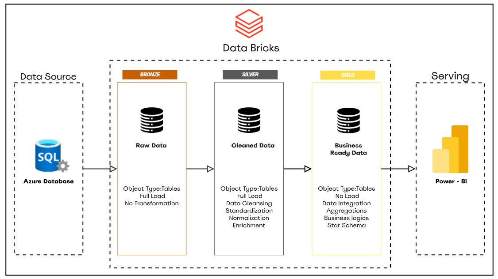

# Customer Complaint Pipeline: Azure SQL to Databricks Medallion Architecture

A data engineering pipeline that ingests customer complaint data from Azure SQL Database, processes it through a Bronze, Silver, Gold Medallion Architecture on Databricks, and serves business-ready insights via Power BI.

## Architecture Overview



The pipeline follows the Medallion Architecture pattern, a multi-layered approach that progressively refines raw data into trusted, analytics-ready datasets.

| Layer | Name | Purpose |
|-------|------|---------|
| Bronze | Raw Data | Incremental ingestion from Azure SQL, no transformation |
| Silver | Cleaned Data | Cleansing, standardization, normalization, and enrichment |
| Gold | Business Ready Data | Aggregations, business logic, Star Schema for reporting |

## Bronze Layer

The Bronze layer is the entry point of the pipeline. It pulls customer complaint records directly from Azure SQL Database with no modifications, the data lands exactly as it exists in the source.

A key feature of this layer is incremental loading: instead of reloading all data every run, the pipeline filters by date and only picks up the newest records since the last ingestion. This keeps the pipeline efficient and avoids processing the same data twice.

## Silver Layer

The Silver layer takes the raw Bronze data and makes it clean and consistent. This is where the data gets prepared for analysis:

- Removing nulls, duplicates, and invalid records
- Standardizing formats (dates, text casing, categories)
- Normalizing complaint fields so they are uniform across the dataset
- Enriching records with additional context where needed

The output is a reliable, clean version of the complaint data ready for business use.

## Gold Layer

The Gold layer transforms the cleaned data into a Star Schema optimized for reporting. This includes building fact and dimension tables, applying business logic, and computing aggregations such as complaint volumes, resolution rates, and trends over time.

This is what Power BI reads directly to generate dashboards and reports.

## Key Features

- **Incremental Loading**: Only new complaint records are ingested each run, filtered by date, avoiding redundant reloading.
- **Automated Orchestration**: The full Bronze, Silver, Gold pipeline runs as a single automated Databricks Job.
- **Delta Lake Storage**: All layers use Delta format for reliability, consistency, and data versioning.
- **Star Schema Gold Layer**: Fact and dimension tables structured for efficient Power BI consumption.
- **Separation of Concerns**: Each layer has one clear responsibility, making the pipeline easy to maintain and extend.

## Tech Stack

| Component | Technology |
|-----------|------------|
| Source Database | Azure SQL Database |
| Processing Engine | Apache Spark (Databricks) |
| Transformation Language | Spark SQL / PySpark |
| Storage Format | Delta Lake |
| Orchestration | Databricks Jobs |
| Visualization | Microsoft Power BI |

## 📁 Project Structure

```
├── bronze/
│   └── bronze.ipynb
├── silver/
│   └── silver.ipynb
├── gold/
│   └── gold.ipynb
└── README.md
```

## Getting Started

### Prerequisites

- Databricks workspace (Azure)
- Azure SQL Database with source complaint tables
- Power BI Desktop (for visualization)

### Setup

1. **Clone the repository**
   ```bash
   git clone https://github.com/nhahub/NHA-4-073.git
   ```

2. **Import notebooks into Databricks** and attach to a cluster.

3. **Configure the connection** to Azure SQL inside the notebooks (JDBC URL, credentials).

4. **Create a Databricks Job** and add the three notebooks in order:
   ```
   bronze -> silver -> gold
   ```

5. **Connect Power BI** to the Gold layer via the Databricks SQL connector.

## Power BI Integration

The Gold layer's Star Schema is directly consumed by Power BI using the Databricks SQL connector. Dashboards cover:

- Complaint volume over time
- Complaint categories and trends
- Resolution rates and turnaround time
- KPI summary cards